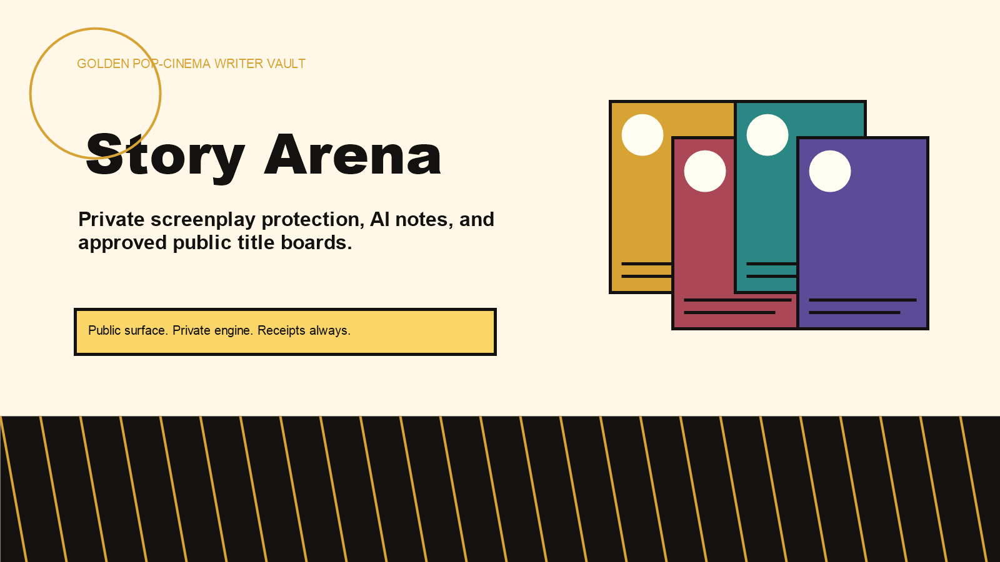
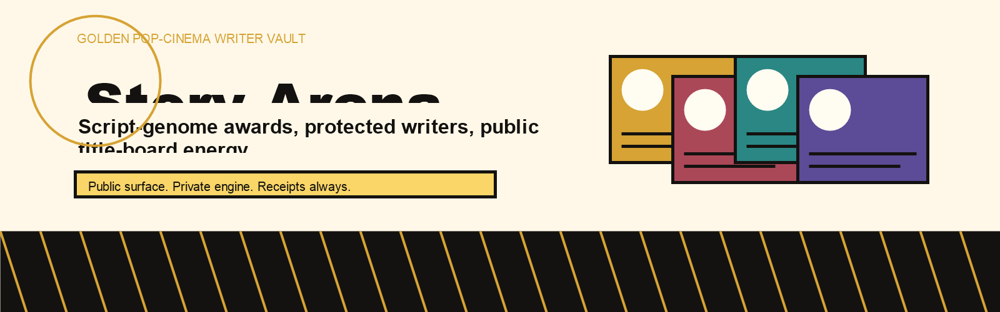
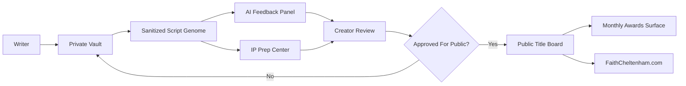

# Story Arena

Story Arena is a protected public project surface for an AI-assisted screenwriting platform. It presents the mission, workflow, visual direction, and public/private boundaries for a writer-first system where screenplays can stay private while creators receive feedback, protection guidance, and approved public title-board moments.

This repository is a protected public project surface. It is not the full source code, operational system, private workflow, or data room.

## Why It Matters

Screenwriters need more than a submission form. They need privacy, receipts, authorship protection, useful feedback, and a public surface that does not force them to reveal unfinished work. Story Arena is designed around that principle: public visibility should be opt-in, reviewable, and separated from private creative material.

## Who It Is For

- Screenwriters developing original scripts
- Creators who want AI notes without exposing private drafts
- Judges, producers, and partners who need approved public metadata
- FaithCheltenham.com visitors exploring the public Story Arena board
- Future collaborators who need to understand the project without accessing the private engine

## How It Works

## Public Materials

The public surface may include project overview, approved summaries, title-board metadata, workflow visuals, brand notes, selected gold-cinema assets, and WordPress page copy.

## Protected Materials

The protected system includes private screenplays, raw prompts, uploads, scripts, operational code, deployment systems, credentials, admin workflows, non-public legal/admin files, and private AI context.

## Visual System

Story Arena now points toward a bright golden pop-cinema database style: old-school IMDb utility, creator-vault privacy, and warm stage polish. The public visual set uses the golden Story Arena assets from the current WordPress build and excludes older dark anime references from public use.

## Status

Public export package prepared for GitHub. The canonical runtime remains the private WordPress plugin at FaithCheltenham.com.

Primary public route after deploy:

https://faithcheltenham.com/ai-screenwriters/

## Ownership

All rights reserved. No public license is granted. No redistribution, commercial reuse, model training, scraping, or source-code use is permitted without written permission from Faith Cheltenham / XXYYZZ Society.

## Learn More

- Project brief: [docs/PROJECT_BRIEF.md](docs/PROJECT_BRIEF.md)
- Public/private boundary: [docs/PUBLIC_PRIVATE_BOUNDARY.md](docs/PUBLIC_PRIVATE_BOUNDARY.md)
- Workflow diagrams: [docs/WORKFLOW_DIAGRAMS.md](docs/WORKFLOW_DIAGRAMS.md)
- WordPress page draft: [wordpress/page.md](wordpress/page.md)
