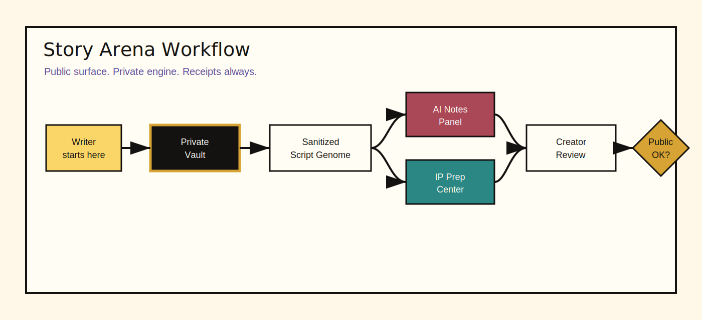
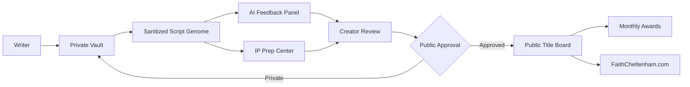
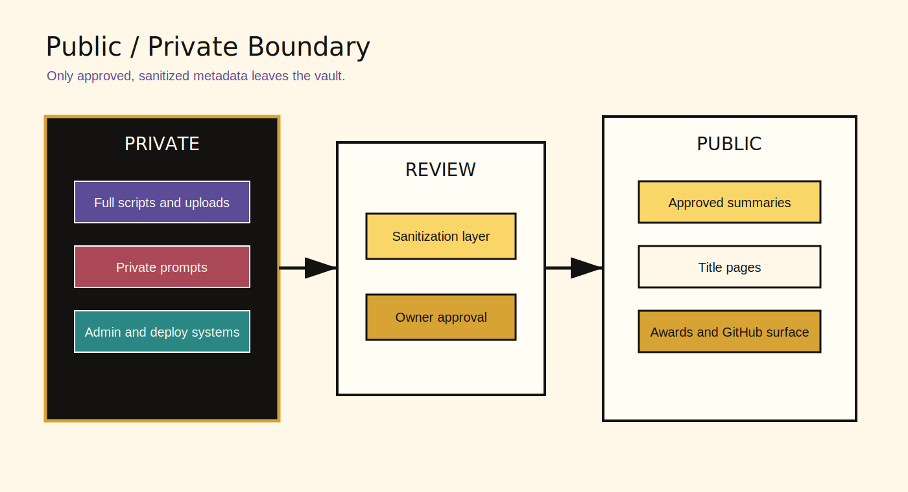
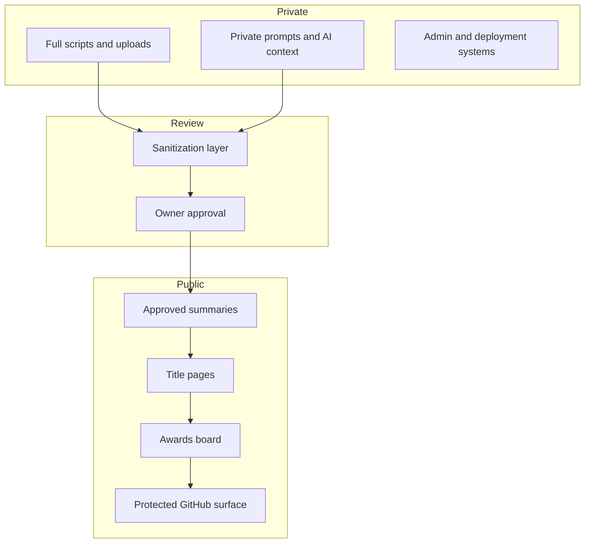

# Workflow Diagrams

## Workflow Overview

Source Mermaid:

```mermaid
flowchart LR
  Writer[Writer] --> Vault[Private Vault]
  Vault --> Genome[Sanitized Script Genome]
  Genome --> Feedback[AI Feedback Panel]
  Genome --> IP[IP Prep Center]
  Feedback --> Review[Creator Review]
  IP --> Review
  Review --> Decision{Public Approval}
  Decision -->|Private| Vault
  Decision -->|Approved| Board[Public Title Board]
  Board --> Awards[Monthly Awards]
  Board --> Site[FaithCheltenham.com]
```

## Public / Private Boundary

Source Mermaid:

```mermaid
flowchart TB
  subgraph Private
    Drafts[Full scripts and uploads]
    Prompts[Private prompts and AI context]
    Admin[Admin and deployment systems]
  end
  subgraph Review
    Sanitizer[Sanitization layer]
    Owner[Owner approval]
  end
  subgraph Public
    Summary[Approved summaries]
    Title[Title pages]
    Awards[Awards board]
    GitHub[Protected GitHub surface]
  end
  Drafts --> Sanitizer
  Prompts --> Sanitizer
  Sanitizer --> Owner
  Owner --> Summary
  Summary --> Title
  Title --> Awards
  Awards --> GitHub
```
